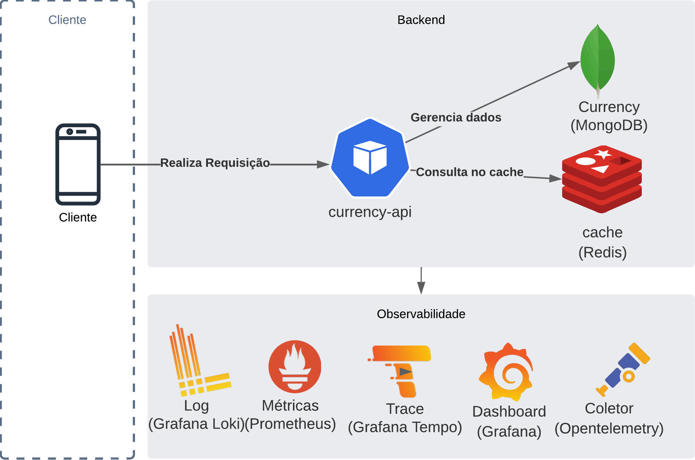

# currency-api
[](https://github.com/kirmayrcosta/currency-api/actions/workflows/build.yml) [](https://codecov.io/github/kirmayrcosta/currency-api)


* [Introdução](#introdução)
* [Estrutura do projeto](#estrutura-do-projeto)
* [Rodando projeto localmente](#rodando-projeto-localmente)
* [Arquitetura do Projeto](#arquitetura-do-projeto)
  * [Componentes de serviços do projeto](#componentes-de-serviços-do-projeto)
* [Documentação da API](#documentação-da-api)
* [Cenários de caso de uso](#cenários-de-caso-de-uso)
* [Pipeline](#pipeline)
  * [Pipeline de CI - Pull Request](#pipeline-de-ci---pull-request)
  * [Pipeline de CI - Merge Request](#pipeline-de-ci---merge-request)
* [Resiliência](#resiliência)
* [Estrutura de observabilidade](#estrutura-de-observabilidade)
  * [Tracing](#tracing)
  * [Log e Métricas](#log-e-métricas)

* [Autor](#autor)


# Introdução

Este projeto é uma API REST que fornece informações sobre moedas. A API foi desenvolvida utilizando Node.js, TypeScript, Nests.js, MongoDB e Redis.


# Estrutura do projeto

O projeto foi desenvolvido utilizando o padrão Clean Architecture, que consiste em dividir o projeto em camadas, onde cada camada tem uma responsabilidade específica. A estrutura do projeto é a seguinte:

```

├── backend
│   ├── src
│   │   ├── domain # Camada de Dominio para regras de negócio
│   │   │   ├── entities # Entidades do domínio
│   │   │   │   ├── currency.entity.ts
│   │   │   ├── protocols # Interfaces para protocolos de comunicação
│   │   │   ├── repository # Interfaces para repositórios
│   │   ├── usecases # Camada intermedira de casos de uso de usuário
│   │   ├── infra # Camada de mais exposta de infraestrutura (ex: banco de dados, cache, log, etc)
│   │   │   ├── commons # Classes e funções comuns
│   │   │   ├── config # Instâncias das variaveis de ambiente
│   │   │   ├── controller # Controllers de entrada da API (ex: rotas)
│   │   │   ├── filter # Filtros de saída da API
│   │   │   ├── interceptor # Interceptadores da API (ex: log, cache)
│   │   │   ├── protocol # Protocolos de comunicação
│   │   │   ├── repository # Repositórios com comunicação com base de dados
│   │   │   ├── schema # Schemas do banco de dados
│   ├── test
│   │   ├── e2e # Pasta de Testes de contrato
│   │   ├── unit # Testes unitários
├── infra
│   ├── docker # Arquivos de configuração do docker
│   ├── k8s # Arquivos de configuração do kubernetes para deploy
```

# Rodando projeto localmente

Para executar o projeto, é necessário ter o Docker e o Docker Compose instalados. Para executar o projeto, basta executar o seguinte comando:

- Node 18.4.0
- NPM 6.14.14
- Docker 20.10.14
- Docker Compose 1.29.2

Subindo componentes de infraestrutura

```bash
cd infra/docker
docker-compose up -d
```

Subindo backend
    
``` bash

cd backend

# Instalando dependências
npm install

# Executando projeto
npm run start:dev
```


# Arquitetura do Projeto

A estrutura do projeto foi pensada para ser escalável tando em padrão de código e também em infraestrutura. Segui as boa parte do que entendo que deveria ser uma arquitetura de referência de projetos em microserviço. 

Abaixo segue a estrutura da arquitetura do projeto.



## Componentes de serviços do projeto

- **Base de dados Mongodb**: A escolha da base de dados foi pela simplicidade de implementação e por ser uma base de dados não relacional, que é mais performática para leitura de dados.
- **Cache Redis**: Estrutura que garantirá maior resiliência e performance para a aplicação.
- **Currency API**: Nodejs com Nestjs, foi pela facidade de integração e padronização de injeção de dependência.
- **Opentelmetry**: Estrutura de coleta de Trace e Métrica. Indispensável em projetos que não possuem APM terceiros
- **Grafana Tempo** Estrutura para armazenamento de Trace
- **Prometheus**: Estrutura para armazenamento de métricas e alertas. Métricas que serão armazenadas são as Golden Signals (Latência, Erros, Satifação e Tráfego)
- **Grafana Loki** Estrutura de log, escolhida por ser mais simples que a stack do Elastic
- **Grafana** Visuação de métricas, logs e trace com dashboard

## Documentação da API

A documentação da API foi feita utilizando o Swagger. Para acessar a documentação, basta acessar o endereço 

Endereço de documentação: http://localhost:3000/swagger


## Cenários de caso de uso
  - O sistema deverá realizar uma requisição com o valor em real e retornar o resultado nas cotações de outras moedas
  - O sistema deverá ser capaz de adicionar novas moedas
  - O sistema deverá ser capaz de Atualizar moedas
  - O sistema deverá ser capaz de deletar moeda
  - O sistema deverá ser capaz de atualizar a moeda
  - O sistema deverá ser capaz de criar cotação para moeda
  - O sistema deverá ser capaz de atualização cotação para moeda
  - O sistema deverá ser capaz de deletar cotação para moeda

# Pipeline


### Pipeline de CI - Pull Request

A estrutura de pipeline executa um ciclo das seguintes ações


- **Lint**: Realiza a análise de qualidade de código
- **Teste unitário**: Executa testes unitários e todos os testes devem passar
- **Teste de Integração**: Executa os testes integração e todos os testes devem passar
- **Code Coverage**: Deploy em codecov mas não gera bloqueio


### Pipeline de CI - Merge Request

Estrutura para realização de deploy

- **Build**: Realiza o build da aplicação
- **Publica imagem**: Publica a imagem no Google Container Registry
- **Deploy**: Realiza o deploy da aplicação no Google Kubernetes Engine


## Resiliência

Dos padrões de resiliência foram implantados os seguintes:
- **Cache**: Para evitar que a aplicação faça requisições desnecessárias para a base de dados, foi implementado um cache com Redis
- **Timeout**: Para evitar que a aplicação fique presa em requisições, foi implementado um timeout de 5 segundos

Outras mecanismo como Circuit Breaker, Retry, throttling  seriam interessantem ser implementados numa camada de BFF, Api Gateway ou service Mesh


## Estrutura de Observabilidade


# Métricas

Para estrutura de métrica, foi criado um dashboard com grafana coletando dados do prometheus. Algumas consutas de top requisições e também de latência foram criadas para exemplificar a analise de performance da aplicação

**Cálculo de top requisições**
```
sort_desc(sum(increase(http_server_responseTime_count{}[5m]))  by (statusCode,path,method))
```


**Cálculo de latência**
```
histogram_quantile(0.95, sum by(le, path) (rate(http_server_responseTime_bucket{job="otel-collector"}[$__rate_interval])))
```

Caso necessário, pode ser criado um alerta para latência da aplicação


### Log e Trace

A estrutura de log e trace podem ser visualizam com correção, por conta da customização da biblioteca do opentelemetry.
Na imagem abaixo, é um print da Explorer do grafana acessando a Currency API


## Débitos Técnicos

- Sem implantação de migrations
- [**CI**] Merge Request sem estrutura de tag
- [**CI**] Merge Request sem estrutura de rollback
- [**CI**] Merge Request sem estrutura de deploy por ambiente
- [**Arquitetural**] Gateway de API não implementado
- [**Arquitetural**] Feature Toggle não implementado
- [**Arquitetural**] Utilização do Mongo como container no kubernetes, sem integração com mongo atlas
- [**Arquitetural**] Coletor em produção recebendo somente dados sem envio para backend


# Autor

Kirmayr Costa

[](https://www.linkedin.com/in/kirmayrcosta/) 


